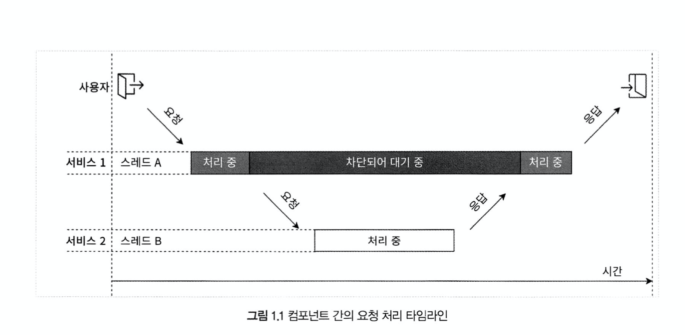
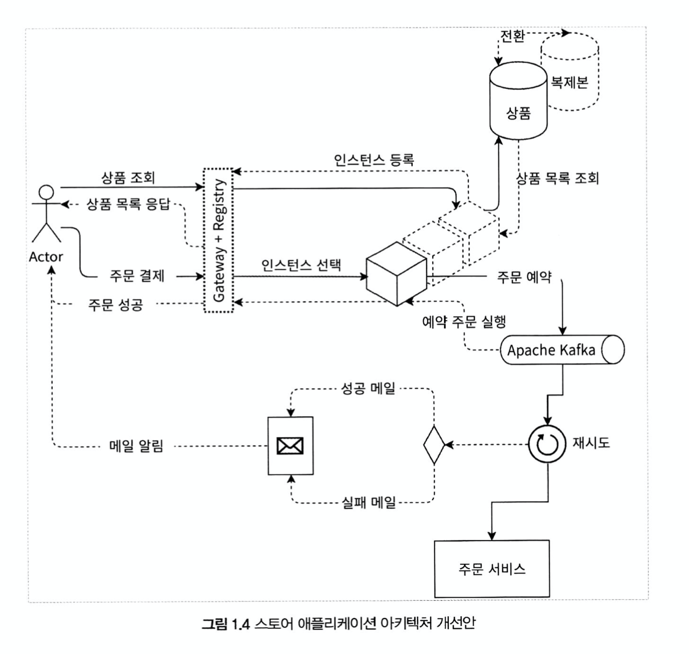
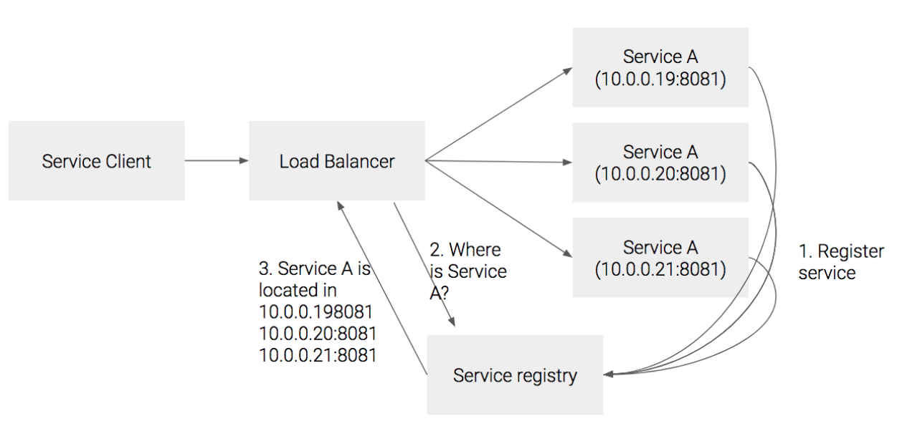
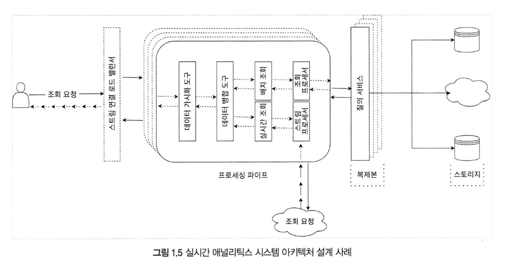
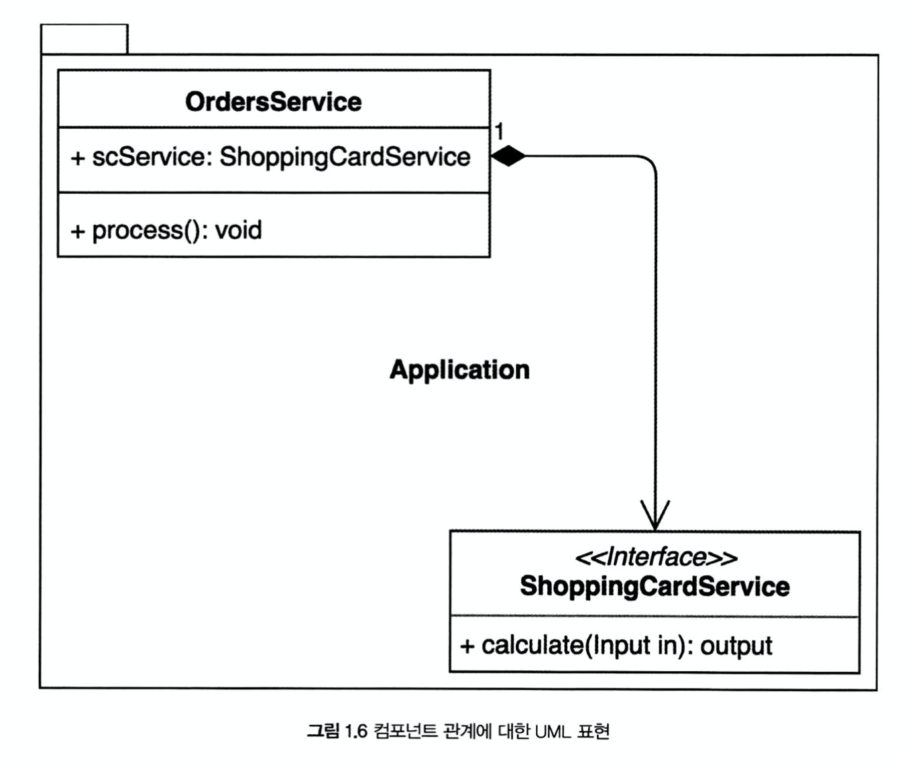

# 왜 리액티브 스프링인가 ? 

## 왜 리액티브인가 ?
웹 기반 온라인 상점을 만든다고 가정해보자.  
시간당 약 1,000 명의 사용자가 방문한다는 요구 사항에 따라서 톰캣 웹 서버에 500 개의 thread 로 thread pool 을 구성하면  
초당 평균 응답시간은 250 ms 로 초당 약 2,000 명의 사용자 요청을 처리 가능하다  
그런데 블랙 프라이데이에 고객의 요청이 폭발적으로 증가한다면 .. ? -> 트래픽을 감당하지 못해서 고객들은 다른 서비스를 이용하게 될 것이다 ..  
  
이러한 문제를 어떻게 해결할 것인가 ?  
문제를 해결하는 첫번째 방법은 Elasticity (탄력성) 을 갖는 서비스를 구축하는 것  
- Elasticity 은 다양한 작업의 부하에서 응답성을 유지하는 것을 의미

즉, 서비스는 더 많은 사용자가 요청할 때 시스템 처리량이 자동으로 증가하고 요청이 감소하면 자동으로 감소해야 한다 
Elasticity 가 없는 시스템에는 요청이 늘어나게 되면 자연적으로 Latency 가 증가하게 된다 
  
단순히 처리량을 늘리기 위해서 추가 자원, 인스턴스 등을 추가할 수도 있을 것이다.  
하지만 이 방법은 요청이 감소하면 모두 리소스 낭비가 된다  

> 수평적 수직적 확장을 통해서 탄력성을 달성할 수 있지만, 이것은 일반적으로 분산 시스템의 시스템 병목 지점 또는 동기화 지점을 확장하는것에 그친다  
> 이러한 문제는 암달의 법칙과 건터의 보편적 확장 모델로 설명할 수 있는데, 6장에서 소개함
> 암달의 법칙(Amdahl's Law) : 이 법칙은 병렬 처리가 가능한 시스템에서는 병렬 처리가 가능한 부분과 불가능한 순차 처리 되어야 하는 부분으로 나뉘기 때문에 프로세스 코어를 증가시켜서 시스템 성능 향상에는 한계가 있음을 알려주는 법칙 
> 건터의 보편적 확장 모델(Gunther Universal Scalability Model) : 암달의 법칙을 확장한 모델로 프로세스간 통신으로 인한 오버헤드를 설명함  
> [관련 블로그](https://wso2.com/blog/research/scalability-modeling-using-universal-scalability-law)
  
TODO:
연동한 결제 시스템이 장애가 났다고 가정해보자. 이런 경우    
시스템 실패에도 반응성을 유지할 수 있는 Resilience(복원력)을 유지해야한다 
이는 시스템의 기능 요소들을 격리해서 독립성을 확보해야 가능 
ㄴ 뒤에 나올 듯 


## 메시지 기반 통신 
분산 시스템에서 컴포넌트들을 연결 방법, 낮은 결합도, 시스템 격리 및 확장성 유지를 위해서 어떻게 해야 할까 ?  
  
우선 spring 에서 HTTP 를 이용한 통신 방법을 살펴보자  
```java
@RequestMapping("/resource")
public Object processRequest() {
    // spring 4 에서 사용되는 HTTP 요청을 위한 클라이언트 
    RestTemplate template = new RestTemplate();
    // 요청을 호출한다 
    ExampleCollection result  = template.getForObject("http://example.com/api/resource2", ExampleCollection.class);
    ...
    processResultFurther(result);
}
```
/resource 요청을 받으면 다른 서비스(http://example.com/api/resource2) 를 호출하여 해당 결과를 이용해서 응답을 생성하는 메소드를 선언했다  
위 코드에는 약간의 문제가 있는데, 아래 그림을 보자  
  
위 그림에서 볼 수 있듯이 서비스1 은 서비스2 에서 응답이 오기 전까지는 해당 스레드가 blocking 되기 때문에 해당 스레드는 다른 요청을 처리 할 수 없다  
이것은 리소스 낭비이기 때문에 이런 문제를 해결하기 위해서 비동기 non-blocking 모델을 사용해야 한다  
      
이러한 비동기 non-blocking 은 일상 생활에서 쉽게 찾아 볼 수 있는데, 대표적으로 이메일, 문자 메시지 전송이다
message-driven 통신 원칙을 이용해서 구현 할 수 있으며, 이는 분산 시스템에서 서비스 간에 통신을 할 때 자원을 효율적으로 사용하기 위해서 필요하다     
분산 시스템에서 구성 요소들은 메시지 도착을 기다리고 이에 반응하며, 나머지 시간에는 휴식을 취하고 non-blocking 방식으로 메시지를 보낼 수 있어야 한다  
이러한 접근 방식은 각 구성 요소들의 위치 투명성을 제공하여 시스템의 확장성을 향샹 시키며, 특정 장비에 장애가 발생하더라도 수신자는 다른 장치를 통해 읽을 수 있기 때문에 복원력이 향상된다  
  
이런 message-driven 통신을 수행하는 방법 중에 message broker (메시지 브로커) 를 이용하는 방법이 있음  
ㄴ RabbitMQ, Kafka 등이 대표적임  

## 리액티브 시스템의 기본 원칙 
[리액티브 선언문](https://www.reactivemanifesto.org/en)는 리액티브 애플리케이션과 시스템 개발의 핵심 원칙을 공식적으로 정의한다  
  
- Responsive (응답성) : 시스템이 가능한 한 사용자에게 즉시 응답하고 문제를 신속하게 탐지하고 대처할 수 있음을 의마한다. 응답성이 있는 시스템은 **일관성 있는 응답 시간을 제공**한다    
- Resilient (탄력성) : 시스템에 장애가 발생하더라도 응답성을 유지하는 것을 의미한다. 탄력성은 복제(replication), 격리(isolation), 위임(delegation) 으로 구현된다 
- Elastic (유연성) : 시스템의 작업 량이 변화하더라도 응답성을 유지하는 것을 유연성이라고 한다. 즉 요청의 증가, 감소에 따라서 자원을 증가시커나 감소 시킬 수 있음을 의미한다  
- Message Driven (메시지 구동) : 리액티브 시스템은 비동기 메시지 전달을 이용해서 구성 요소 간의 느슨한 결합, 격리, 위치 투명성을 지원할 수 있도록 경계를 명확히 정의할 수 있다.
    * 경계는 장애를 메시지로 전송하는 수단을 제공 -> 탄력성  
    * 명시적인 메시지 전달은 시스템에 메시지 큐를 생성하고 모니터링하여 배압(backpressure)을 제공 -> 유연성 
        
TODO:
> [Lightbend 의 설립자이자 CTO 인 Jonas Boner 가 리엑티브 선언문의 중요성에 대해서 설명한 글](https://www.lightbend.com/blog/why-do-we-need-a-reactive-manifesto) 


## 반응성에 대한 유즈 케이스 
이전에 얘기 했던 웹 스토어 어플리케이션에서 리액티브를 적용한 아키텍쳐를 소개한다  

위 그림을 보면 알 수 있듯이 API 게이트웨이 패턴을 사용하여 위치 투명성을 달성했다  
- API 게이트웨이 패턴
여러 클라이언트 앱이 있는 대규모 또는 복잡한 마이크로 서비스 기반 어플리케이션을 다자인하고 빌드하는 경우 API 게이트 웨이가 좋은 방법일 수 있음   
이 방법은 MSA 특정 그룹에 단일 진입점 서비스를 제공하는 방법으로 클라이언트 앱의 요구 사항을 고려하면서 작성되어 BFF(프런트 엔드의 백 엔드) 라고도 불림  
API 게이트웨이는 클라이언트 앱과 마이크로 서비스 사이에 위치하며 클라이언트에서 서비스로 요청을 라우팅하는 역방향 프록시로 사용된다  
이러한 API 게이트웨이를 이용해서 인증, SSL, 종료 및 캐시와 같은 추가 기능을 제공할 수 있음  
  
좀 더 자세한 내용은 아래 링크를 참조   
[MS - 클라이언트 MSA 직접 통신 vs API 게이트웨이 패턴](https://docs.microsoft.com/ko-kr/dotnet/architecture/microservices/architect-microservice-container-applications/direct-client-to-microservice-communication-versus-the-api-gateway-pattern)
  
- [Location Transparency (위치 투명성)](https://www.reactivemanifesto.org/ko/glossary#Location-Transparency)
위치 투명성은 실제 위치가 아닌 이름을 사용하여 네트워크 리소스를 식별하는 것으로 분산 시스템에서는 사용자가 리소스를 요청할 때, 해당 리소스의 이름을 이용하여 리소스를 제공할 수 있음을 의미한다  
ㄴ [위키 - Location_transparency](https://en.wikipedia.org/wiki/Location_transparency)     
리액티브 시스템에서는 비동기 메시지 기반으로 활성화된 공간 분리와 실행시간 인스턴스의 참조 분리로 위치 투명성을 달성한다  
  
띠라서 API 게이트웨이는 사용자의 요청에 해당하는 서비스 이름을 제공 받아서 리지스트리 서비스(서비스 저장소)에 요청해서 특정 서비스 주소를 확인할 수 있다   
서비스 레지스트리 패턴으로 각 서비스가 active 한지 판별하는 책임을 분리하고 클라이언트 측 디스커버리 패턴으로 구현했다 
- 서비스 레지스트리 : MSA 에서 서비스를 등록하는 전략을 의마하며 가장 단순한 예는 DNS 이며 전문화된 솔루션으로 zookeeper, etcd 가 있다 
- 서비스 디스커버리 패턴: MSA 를 클라우드 환경에 올리다 보면 각 서비스의 IP 가 동적으로 변경되는 경우가 많은데, 클라이언트 측에서 서비스의 위치(IP)를 알기 위한 기능을 말한다  
    * client-side : 클라이언트가 직접 서비스 레지스트리를 조회하여 서비스의 위치를 찾는 방법  
    
    * server-side : 아래 그림에서 처럼 서비스 앞 단에 proxy(로드 밸런서)를 넣어서 클라이언트는 로드 밸런서를 호출하면 로드 밸런서가 서비스 레지스트리에서 등록된 서비스의 위치를 반환하는 방법 
     
    * 서비스 디스커버리의 전문호된 솔루션으로는 Netflix 의 Eureka 나 Hashicorp 의 Consul 과 같은 서비스가 있다  
출처: [조대협-서비스 디스커버리 패턴:](https://bcho.tistory.com/1252)
  
또한 아파치 카프카를 이용하여 메시지 기반 통신을 구현하고 독립적인 결제 서비스를 구축하여 장애 복원력을 구현한다  
응답성을 유지하기 위해서 주문 요청을 받자마자 우선 응답을 보낸 후 결제 요청, 결제 결과 안내 등은 비동기로 처리한다    
> MSA 관련된 디자인 패턴 자세한 내용 : [https://microservices.io/patterns/](https://microservices.io/patterns/)  

### Analytics 분야
온라인 웹 스토어와 같이 리액티브 시스템이 적절한 분야 중 하나는 Analytics 분야  
Analytics 분야는 엄청난 양의 데이터를 다루면서 런타임에 처리하고 사용자에게 실시간으로 통계를 제공한다  
  
예를들어 기지국 데이터를 기반으로 통신망을 감지한다고 해보자  
이 시스템을 구축하기 위해서 스트리밍 아키텍쳐를 사용한다  
 
일반적으로 이런 시스템은 짧은 지연 시간과 높은 처리량이 특징이다  
따라서 통신 네트워크 상태에 대한 내용을 응답하거난 전달하는 능력이 매우 중요하다  
이런 시스템을 구축하기 위헤서는 **리액티브 선언문에서 언급한 기본원칙에 의존**해야 한다  
예를 들어 복원성 확보를 위해서는 Back Pressure(배압) 을 지원해야 한다  
- Back Pressure : 한 컴포넌트가 부하를 이겨내기 힘들 때, 시스템 전체가 합리적인 방법으로 대응하는 것으로 과부하 상태의 컴포넌트에 장애가 발생하지 않도록 상위 컴포넌트들이 알아서 제어  

## 왜 리액티브 스프링인가 ? 
JVM 세계에서는 리액티브 관련 여러 프레임 워크가 존재한다 
- Akka, Vert.x, RxJava, Reactor, etc
그렇다면 왜 스프링 리액티브 일까 ?


### 서비스 레벨에서의 응답성
하나의 시스템은 작은 시스템의 조합으로 구성되기 때문에 각 요소들의 리액티브 특성에 의존하게 된다. 
즉 리액티브 시스템 설계 원칙을 모든 구성 요소에 적용하고 합성할 수 있어야 함


위 그림과 같은 쇼핑 카드 서비스를 구성한다고 해보자  

- 명령형 프로그래밍(imperative-programing)
```java
public interface ShoppingCardService {
    Output calculate(Input value);
}

public class OrdersService {
    private final ShoppingCardService shoppingCardServiceCallbacks;

    void process() {
        Input input = new Input();
        // 동기적으로 호출하고 실행 직후 결과를 얻는 방식 
        // 해당 서비스가 blocking 
        Output output = shoppingCardServiceCallbacks.calculate(input);

        System.out.println(scService.getClass().getSimpleName() + " execution completed");
    }
}
```
OrdersService 는 ShoppingCardService 의 결과와 강결합된다  
위와 같은 blocking 방식은 ShoppingCardService 가 결과를 반환 할 때까지 OrdersService 는 아무일도 하지 못한다   
그리고 이러한 blocking 방식은 리액티브 시스템에서 비동기 메시지 기반 원칙에 모순된다  
- [Message Driven](https://www.reactivemanifesto.org/ko/glossary#Message-Driven)

- 콜백 기법
여기서는 위에서 설명한 OrdersService 는 ShoppingCardService 의 결과에 대한 강결합을 분리(decoupled)할 것  
```java
public interface ShoppingCardService {
    // consumer 를 이용한 콜백 메소드 전달 
    void calculate(Input value, Consumer<Output> consumer);
}

public class OrderService {
    private final ShoppingCardService shoppingCardServiceCallbacks;

    void process() {
        Input input = new Input();
        // 실행만 하고 결과는 콜백 메서드에서 처리 
        shoppingCardServiceCallbacks.calculate(input, output -> {
            System.out.println(shoppingCardServiceCallbacks.getClass().getSimpleName() + " execution completed");
        });
    }
}
``` 
OrderService 는 ShoppingCardService 에게 콜백 메소드만 전달하고 결과에 관여하지 않으므로써 decoupled 됨  
그리고 목적에 따라 동기, 비동기식으로 ShoppingCardService 인터페이스를 구현할 수 있다   
- 콜백 + 동기식 구현 
```java
public class SyncShoppingCardService implements ShoppingCardService {
    @Override
    public void calculate(Input value, Consumer<Output> consumer) {
        consumer.accept(new Output());
    }
}
```
여기서는 별도의 I/O 작업이 없기 때문에 blocking 은 일어나지 않는다  
ㄴ 이런 구현을 왜 했는지 알 수 없지만, 추측컨데 blocking 작업이 일어나는 것은 큰 장점이 없어서 인 듯 ..   

- 콜백 + 비동기식 구현
```java
public class AsyncShoppingCardService implements ShoppingCardService {
    @Override
    public void calculate(Input value, Consumer<Output> consumer) {
        new Thread(() -> {
            Output result = template.getForObject("");
            //...
            consumer.accept(result);
        }).start();
    }
}
```
비동기식 구현으로 I/O 작업이 일어날 때 별도의 thread 로 래핑하여 콜백을 받도록 구현한다  
  
콜백 + 동기식/비동기식 구현의 예제들의 장점은 컴포넌트가 콜백 함수에 의해서 분리된다는 것이다  
즉, OrdersService 는 ShoppingCardService.calculate() 의 결과를 기다리지 않고 다른 작업을 진행 가능하다  
단점으로는 공유 데이터 변경 및 콜백 지옥을 피하기 위해서 개발자가 멀티 스레딩을 잘 이해하고 있어야 한다는 것이다  

- Future 이용 
이번에는 java 의 내장 클래스는 Future 를 이용해서 콜백 함수를 대신하게 구성할 수 있다  
Future 를 이용하면 실행 동작을 어느 정도 숨기고 구성 요소도 분리가능  
```java
public interface ShoppingCardService {
    Future<Output> calculate(Input value);
}
public class OrdersService {
    private final ShoppingCardService shoppingCardService;

    public void process() {
        Input input = new Input();
        // 여기서 비동기 호출이 발생 
        // ㄴ 사실 즉시 실행되는 것은 아니지만, 실행된다고 보면 됨 
        Future<Output> result = shoppingCardService.calculate(input);
        // ... 추가적인 처리
        
        // 결과가 있으면 바로 가져오고, 없으면 결과가 있을때까지 blocking
        Output output = result.get();
        // ...
    }
}
```
Future 를 이용하면 결과 값 반환을 지연 시키고 콜백 지옥을 피할 수 있으며, Future 를 이용해서 멀티 스레드 복잡성을 숨길 수 있다    
위 코드에서 보이는 것 처럼 calculate() 에서 결과를 생성하는 코드가 느리다면 result.get() 메소드를 실행하여 현재 스레드를 차단해야 한다  
이러한 문제를 피하기 위해서 Java 8 에서는 CompletionStage 및 CompletionStage 의 구현체인 CompletableFuture 를 제공함  

- CompletionStage
```java
interface ShoppingCardService {
    CompletionStage<Output> calculate(Input value);
}
 
 
class OrdersService {
    private final ShoppingCardService scService;
    void process() {
        Input input = ...;
        scService.calculate(input)
                 .thenApply(out1 -> { ... })
                 .thenCombine(out2 -> { ... })
                 .thenAccept(out3 -> { ... });
    }
}
```
CompletionStage 는 Future 와 유사한 래퍼 클래스 이지만 반환된 결과를 처리하는 방식이 다르다  
Future 는 먼저 호출 후, Future.get() 등의 메소드로 결과를 반환 받는 구문이 존재하여 blocking 될 수 있지만,    
CompletionStage 는 위 코드에서 볼수 있듯이 결과에 대한 처리 메소드를 전달하여 처리하는 방식이다  
추가적으로 CompletionStage 는 스트림과 유사하게 메서드 체이닝을 이용한 여러가지 연산을 제공한다  

- ListenableFuture  
스프링 4는 CompletionStage 를 지원하지 않는 구형 자바 버전과의 호환성을 위해서 ListenableFuture 구현하여 자체적으로 제공함  
```java
AsyncRestTemplate template = new AsyncRestTemplate();
SuccessCallback onSuccess = r -> { ... };
FailureCallback onFailure = e -> { ... };
ListenableFuture<?> response = template.getForEntity(
    "http://example.com/api/examples",
    ExamplesCollection.class
);
response.addCallback(onSuccess, onFailure);
```
위 코드는 스프링4 에서 ListenableFuture 을 이용한 콜백 스타일의 비동기 코드인데, CompletionStage 에 비해 코드가 지저분하다  
스프링 프레임워크는 블로킹 네트워크 호출을 별도의 스레드로 래핑하는 방식으로 각각의 요청에 별도의 스레드를 할당하는 서블릿 API 를 사용한다  
  
이러한 모델은 상당히 비효율적이다  
멀티 스레딩의 context switching
- 서블릿 API 는 매 요청마다 스레드를 생성 = 멀티 스레딩 
- 멀티 스레딩 환경에서는 여러 스레드는 CPU 를 공유하면서 context switching 이 일이남
- 빈번한 context switching 은 레지스터, 메모리 맵 및 관련 리소스를 저장하고 다시 불러와야 하기 때문에 오버헤드가 있다 
- 결과적으로 **적은 수의 CPU 에 동시에 많은 수의 스레드를 활성화 시키는 응용 프로그램은 비효율적**   
 
스레드의 메모리   
- 자바 스레드는 메모리 소비에 대한 오버 헤드가 있다  
- 64비트 JVM 에서 스레드의 일반적이 스택의 크기는 1024KB 인데, 만약 64,000 요청을 동시에 처리한다면 64GB 의 메모리가 필요하다  
- 이런 문제를 피하기 위해서 우리는 일반적으로 스레드 풀을 이용하여 관리하지만 요청이 몰리게되면 사용자는 평균 응답 대기 시간이 늘어난다 

이전의 스프링은 논블로킹 작업을 위한 지원이 미비 했으며, 컨텍스트 스위칭 문제를 해결한 네티와 같은 리액티브 서버와는 제대로 된 통합이 이루어지지 않았음
스프링은 이러한 문제를 해결하기 위해서 새로운 모듈은 스프링 웹 플럭스 모듈을 구현하게 된다 
